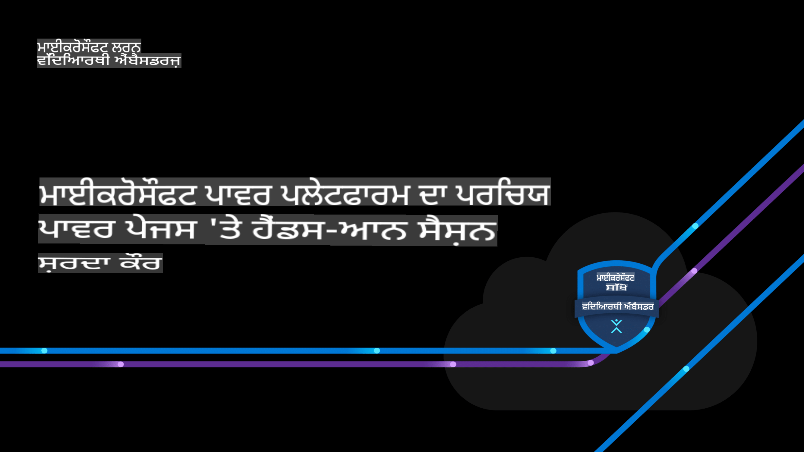

# ਮਾਇਕਰੋਸਾਫਟ ਪਾਵਰ ਪਲੇਟਫਾਰਮ ਨਾਲ ਪਹਿਚਾਣ ਅਤੇ ਪਾਵਰ ਪੇਜਸ 'ਤੇ ਪ੍ਰੈਕਟਿਕਲ ਸੈਸ਼ਨ

## 🌐 ਬਹੁ-ਭਾਸ਼ਾਈ ਸਹਾਇਤਾ

> **Note:**
> ਇਹ ਅਨੁਵਾਦ ਖੁੱਲੇ-ਸਰੋਤ [co-op-translator](https://github.com/Azure/co-op-translator) ਦੀ ਵਰਤੋਂ ਕਰਕੇ ਆਟੋਮੈਟਿਕ ਤੌਰ 'ਤੇ ਕੀਤੇ ਗਏ ਸਨ ਅਤੇ ਇਨ੍ਹਾਂ ਵਿੱਚ ਗਲਤੀਆਂ ਜਾਂ ਅਸੁੱਤੀਆਂ ਹੋ ਸਕਦੀਆਂ ਹਨ। ਮਹੱਤਵਪੂਰਨ ਜਾਣਕਾਰੀ ਲਈ, ਅਸਲ ਨੂੰ ਸਲਾਹ ਦਿਓ ਜਾਂ ਪ੍ਰੋਫੈਸ਼ਨਲ ਮਨੁੱਖੀ ਅਨੁਵਾਦਕ ਨਾਲ ਸਲਾਹ ਕਰੋ। ਜੇ ਤੁਸੀਂ ਕੋਈ ਅਨੁਵਾਦ ਸ਼ਾਮਲ ਕਰਨਾ ਜਾਂ ਅਪਡੇਟ ਕਰਨਾ ਚਾਹੁੰਦੇ ਹੋ, ਤਾਂ ਕਿਰਪਾ ਕਰਕੇ [co-op-translator](https://github.com/Azure/co-op-translator) ਰਿਪੋਜ਼ਟਰੀ 'ਤੇ ਜਾਓ, ਜਿੱਥੇ ਤੁਸੀਂ ਆਸਾਨ ਕਮਾਂਡਾਂ ਦੀ ਵਰਤੋਂ ਕਰਕੇ ਯੋਗਦਾਨ ਦੇ ਸਕਦੇ ਹੋ।

| ਭਾਸ਼ਾ                | ਕੋਡ  | ਅਨੁਵਾਦਿਤ README ਲਈ ਲਿੰਕ                                   | ਆਖਰੀ ਅਪਡੇਟ |
|----------------------|------|---------------------------------------------------------|--------------|
| ਪੰਜਾਬੀ (ਗੁਰਮੁਖੀ)     | pa   | [Punjabi Translation](./README.md)      | 2024-10-25   |
| ਹਿੰਦੀ                | hi   | [Hindi  Translation](../hi/README.md)       | 2024-10-25   |

## ਓਵਰਵਿਊ

ਮਾਇਕਰੋਸਾਫਟ ਪਾਵਰ ਪਲੇਟਫਾਰਮ ਰਿਪੋਜ਼ਟਰੀ ਵਿੱਚ ਤੁਹਾਡਾ ਸਵਾਗਤ ਹੈ! ਇਹ ਪ੍ਰੋਜੈਕਟ ਮਾਇਕਰੋਸਾਫਟ ਪਾਵਰ ਪਲੇਟਫਾਰਮ ਦਾ ਇੱਕ ਸੰਪੂਰਨ ਪਹਿਚਾਣ ਪ੍ਰਦਾਨ ਕਰਦਾ ਹੈ, ਜਿਸ ਵਿੱਚ ਪਾਵਰ ਪੇਜਸ ਦੀ ਵਰਤੋਂ ਕਰਕੇ ਹੱਥ-ਅਨੁਭਵ ਸਿਖਲਾਈ 'ਤੇ ਧਿਆਨ ਕੇਂਦਰਤ ਕੀਤਾ ਗਿਆ ਹੈ। ਪਾਵਰ ਪੇਜਸ ਪਾਵਰ ਪਲੇਟਫਾਰਮ ਦਾ ਇੱਕ ਮੁੱਖ ਹਿੱਸਾ ਹੈ ਜੋ ਉਪਭੋਗਤਾਵਾਂ ਨੂੰ ਆਸਾਨੀ ਨਾਲ ਸੁਰੱਖਿਅਤ, ਡਾਟਾ-ਚਲਿਤ ਵੈੱਬ ਐਪਲੀਕੇਸ਼ਨ ਬਣਾਉਣ ਦੀ ਆਗਿਆ ਦਿੰਦਾ ਹੈ।

ਇਸ ਸੈਸ਼ਨ ਵਿੱਚ, ਤੁਸੀਂ ਪਾਵਰ ਪਲੇਟਫਾਰਮ ਇਕੋਸਿਸਟਮ ਦਾ ਅਧਿਐਨ ਕਰੋਗੇ, ਜੋ ਕਾਰੋਬਾਰਾਂ ਅਤੇ ਵਿਅਕਤੀਆਂ ਨੂੰ ਬਿਨਾਂ ਵਿਸਤ੍ਰਿਤ ਕੋਡਿੰਗ ਗਿਆਨ ਦੇ ਐਪਸ ਬਣਾਉਣ, ਵਰਕਫਲੋਜ਼ ਨੂੰ ਆਟੋਮੇਟ ਕਰਨ, ਡਾਟਾ ਦਾ ਵਿਸ਼ਲੇਸ਼ਣ ਕਰਨ ਅਤੇ ਵਰਚੁਅਲ ਏਜੰਟ ਬਣਾਉਣ ਦੀ ਸਮਰਥਾ ਦਿੰਦਾ ਹੈ। ਇੱਕ ਹੱਥ-ਅਨੁਭਵ ਪਹੁੰਚ ਨਾਲ, ਤੁਸੀਂ ਸਿੱਖੋਗੇ ਕਿ ਪਾਵਰ ਪੇਜਸ ਦੀ ਵਰਤੋਂ ਕਰਕੇ ਵੈੱਬਸਾਈਟਾਂ ਨੂੰ ਕਿਵੇਂ ਡਿਜ਼ਾਈਨ ਅਤੇ ਪ੍ਰਕਾਸ਼ਿਤ ਕੀਤਾ ਜਾ ਸਕਦਾ ਹੈ ਜੋ ਪਾਵਰ ਐਪਸ, ਪਾਵਰ ਆਟੋਮੇਟ ਅਤੇ ਪਾਵਰ ਬੀਆਈ ਵਰਗੇ ਹੋਰ ਪਾਵਰ ਪਲੇਟਫਾਰਮ ਟੂਲਸ ਨਾਲ ਸਹੀ ਢੰਗ ਨਾਲ ਇੰਟੀਗਰੇਟ ਕਰ ਸਕਦੀਆਂ ਹਨ।

ਚਾਹੇ ਤੁਸੀਂ ਇੱਕ ਬਿਗਿਨਰ ਹੋਵੋ ਜਾਂ ਇੱਕ ਅਨੁਭਵੀ ਡਿਵੈਲਪਰ, ਇਹ ਰਿਪੋਜ਼ਟਰੀ ਤੁਹਾਨੂੰ ਬੁਨਿਆਦੀਆਂ ਰਾਹੀਂ ਮਾਰਗਦਰਸ਼ਨ ਕਰੇਗੀ, ਮਦਦ ਕਰੇਗੀ ਕਿ ਤੁਸੀਂ ਪਾਵਰ ਪਲੇਟਫਾਰਮ ਦੀ ਸੰਭਾਵਨਾ ਨੂੰ ਅਨਲੌਕ ਕਰੋ ਅਤੇ ਵੈੱਬ ਹੱਲ ਬਣਾਉ ਜੋ ਅਸਲ ਪ੍ਰਭਾਵ ਪੈਦਾ ਕਰ ਸਕਦੇ ਹਨ।

## ਪ੍ਰਸਤੁਤੀ ਸਮੱਗਰੀ

1. [ਪ੍ਰਸਤੁਤੀ: ਮਾਇਕਰੋਸਾਫਟ ਪਾਵਰ ਪਲੇਟਫਾਰਮ ਨਾਲ ਪਹਿਚਾਣ ਅਤੇ ਪਾਵਰ ਪੇਜਸ 'ਤੇ ਪ੍ਰੈਕਟਿਕਲ ਸੈਸ਼ਨ](./includes/Presentation.md) (✅ ਚਿੱਤਰ ਫਾਇਲਾਂ ਅਨੁਵਾਦ ਲਈ ਵਰਤਮਾਨ ਵਿੱਚ ਸਹਾਇਕ ਹਨ।)

1. [ਪ੍ਰਸਤੁਤੀ: ਮਾਇਕਰੋਸਾਫਟ ਪਾਵਰ ਪਲੇਟਫਾਰਮ ਨਾਲ ਪਹਿਚਾਣ ਅਤੇ ਪਾਵਰ ਪੇਜਸ 'ਤੇ ਪ੍ਰੈਕਟਿਕਲ ਸੈਸ਼ਨ](../../includes/Microsoft-Power-Platform-Intro.pdf) (❌ PDF ਫਾਇਲਾਂ ਵਰਤਮਾਨ ਵਿੱਚ ਅਨੁਵਾਦ ਲਈ ਸਹਾਇਕ ਨਹੀਂ ਹਨ।)

**ਅਸਵੀਕਰਤੀ**:
ਇਹ ਦਸਤਾਵੇਜ਼ ਮਸ਼ੀਨ-ਅਧਾਰਿਤ AI ਅਨੁਵਾਦ ਸੇਵਾਵਾਂ ਦੀ ਵਰਤੋਂ ਕਰਕੇ ਅਨੁਵਾਦ ਕੀਤਾ ਗਿਆ ਹੈ। ਜਦੋਂ ਕਿ ਅਸੀਂ ਸਹੀ ਹੋਣ ਦਾ ਯਤਨ ਕਰਦੇ ਹਾਂ, ਕਿਰਪਾ ਕਰਕੇ ਧਿਆਨ ਦਿਓ ਕਿ ਸਵੈਚਾਲਿਤ ਅਨੁਵਾਦਾਂ ਵਿੱਚ ਗਲਤੀਆਂ ਜਾਂ ਅਸੁਣਭਵਤਾਵਾਂ ਹੋ ਸਕਦੀਆਂ ਹਨ। ਮੂਲ ਦਸਤਾਵੇਜ਼ ਨੂੰ ਇਸ ਦੀ ਮੂਲ ਭਾਸ਼ਾ ਵਿੱਚ ਅਧਿਕਾਰਕ ਸਰੋਤ ਮੰਨਿਆ ਜਾਣਾ ਚਾਹੀਦਾ ਹੈ। ਮਹੱਤਵਪੂਰਨ ਜਾਣਕਾਰੀ ਲਈ, ਪੇਸ਼ੇਵਰ ਮਨੁੱਖੀ ਅਨੁਵਾਦ ਦੀ ਸਿਫਾਰਸ਼ ਕੀਤੀ ਜਾਂਦੀ ਹੈ। ਅਸੀਂ ਇਸ ਅਨੁਵਾਦ ਦੇ ਪ੍ਰਯੋਗ ਤੋਂ ਉਤਪੰਨ ਹੋਣ ਵਾਲੇ ਕਿਸੇ ਵੀ ਗਲਤਫਹਿਮੀਆਂ ਜਾਂ ਗਲਤ ਵਿਆਖਿਆਵਾਂ ਲਈ ਜ਼ਿੰਮੇਵਾਰ ਨਹੀਂ ਹਾਂ।